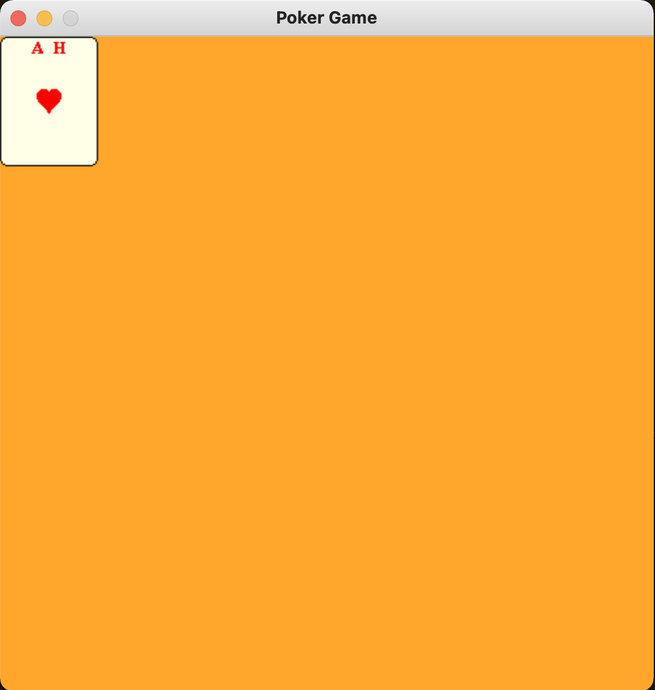
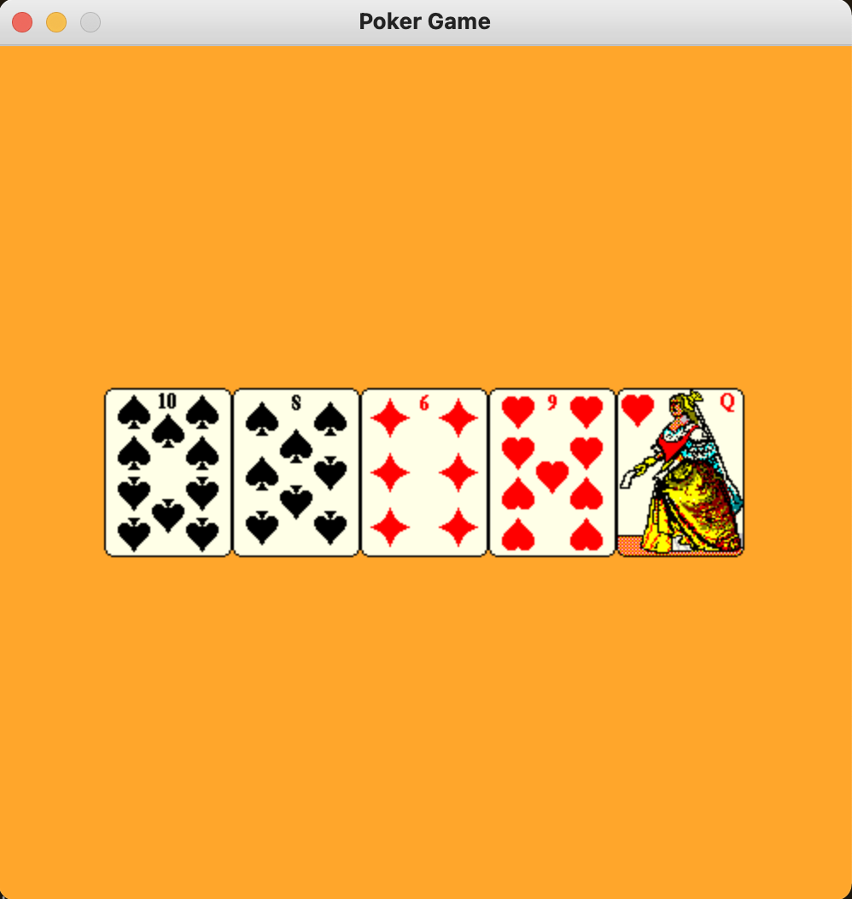

<!--Name Of Class -->

# CardHandSprite

<!-- Description -->

>A CardHandSprite is a hand of x amount of cards.

<!-- Screenshots -->
###### Screenshots
<!--  -->




<!-- Imports -->
###### Imports
```python
import pygame
from CardSprite import CardSprite
```

<!-- Usage -->

###### Usage

```python
# Contructs CardHandSprite object
hand = CardHandSprite()

# Constructs a deck of 52 cards
deck = DeckSprite()

# Shuffles the deck of cards
deck.shuffle()

# Adds five cards to the CardHandSprite object
for i in range(5):
    hand.addCard(deck)

# Centers the CardHandSprite on the screen
hand.centerOnScreen(SCREEN_WIDTH, SCREEN_HEIGHT)

# Draws the CardHandSprite object to the screen
hand.draw(screen)
```

<!-- Instance Variables -->
###### Instance Variables
| Name         | Data Type    | Description                               |
| ------------ | ------------ | ----------------------------------------- |
| `_hand`      | CardSprite[] | hand of CardSprites                       |
| `_numFaceUp` | int          | keeps track of how many cards are flipped |


###### Methods

<ul>

<!-- (Add Member Functions Here) -->
<!-- [`nameOfFunction(parameters)`](functions/nameOfFunction.md) -->
<!-- Make sure to create a .md file in the functions folder for EVERY function added -->

[`addCard(self,deck)`](methods/addCard.md)

[`popCard(self)`](methods/popCard.md)

[`getNumFaceUp(self)`](methods/getNumFaceUp.md)

[`increaseNumFaceUp(self)`](methods/increaseNumFaceUp.md)

[`getNumOfCards(self)`](methods/getNumOfCards.md)

[`getHand(self)`](methods/getHand.md)

[`draw(self,screen)`](methods/draw.md)

[`setPosition(self,x,y)`](methods/setPosition.md)

[`move(self,x,y)`](methods/move.md)

[`centerOnScreen(self,screenWidth,screenHeight)`](methods/centerOnScreen.md)


</ul>

---

<!-- Back to README.md -->
[back](../../../README.md)