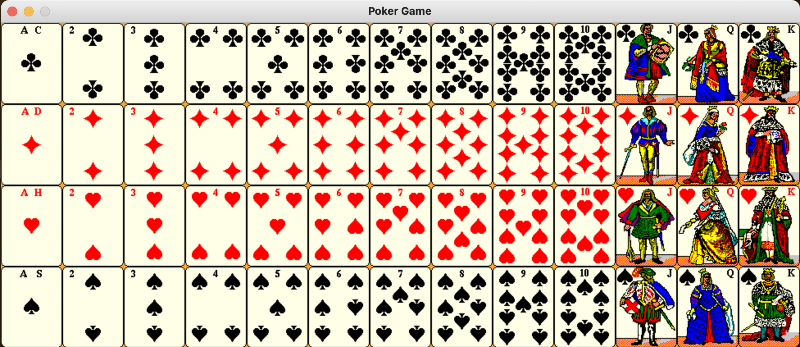
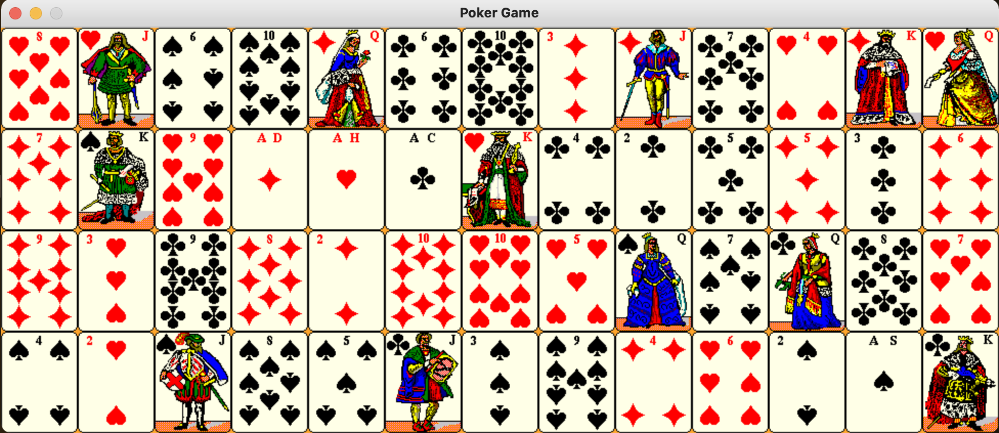

<!--Name Of Class -->

# DeckSprite

<!-- Description -->

>A DeckSprite contains 52 CardSprites.

<!-- Screenshots -->
###### Screenshots
<!--  -->





<!-- Imports -->
###### Imports
```python
from CardSprite import CardSprite
from random import shuffle
```

<!-- Usage -->

###### Usage

```python
# Contructs the deck of 52 cards
deck = DeckSprite()
# Shuffles the deck
deck.shuffle()
```

<!-- Instance Variables -->
###### Instance Variables
| Name          | Data Type    | Description         |
| ------------- | ------------ | ------------------- |
| `_deckSprite` | CardSprite[] | list of CardSprites |


###### Methods

<ul>

<!-- (Add Member Functions Here) -->
<!-- [`nameOfFunction(parameters)`](functions/nameOfFunction.md) -->
<!-- Make sure to create a .md file in the functions folder for EVERY function added -->

[`getDeckSprite(self)`](methods/getDeckSprite.md)

[`initSpriteDeck(self)`](methods/initSpriteDeck.md)

[`shuffle(self)`](methods/shuffle.md)

[`dealCard(self)`](methods/dealCard.md)

[`draw(self,screen)`](methods/draw.md)


</ul>

---

<!-- Back to README.md -->
[back](../../../README.md)