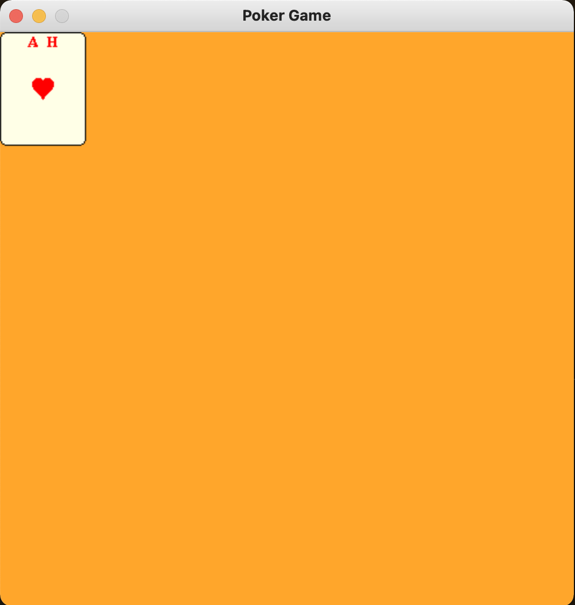

<!--Name Of Class -->

# GameText

<!-- Description -->

>A GameText is a text with a message, font size, font color, and position.

<!-- Screenshots -->
###### Screenshots
<!--  -->


<!-- Imports -->
###### Imports
```python
import pygame
```

<!-- Usage -->

###### Usage

```python
# Constructs a GameText object
text = GameText(message='TEXAS HOLD\'EM', fontSize=75)

# Centers the text to the top center
text.centerOnScreen(SCREEN_WIDTH, SCREEN_HEIGHT, 'top_center')

# Draws the GameText object to the screen
text.draw(screen)
```

<!-- Instance Variables -->
###### Instance Variables
| Name            | Data Type | Description                                     |
| --------------- | --------- | ----------------------------------------------- |
| `_message`      | string    | the text content                                |
| `_font`         | Font      | the font of the text                            |
| `_gameText`     | Surface   | where the text is displayed with the given font |
| `_gameTextRect` | Rect      | stores rectangular coordinates of the Sprite    |


###### Methods

<ul>

<!-- (Add Member Functions Here) -->
<!-- [`nameOfFunction(parameters)`](functions/nameOfFunction.md) -->
<!-- Make sure to create a .md file in the functions folder for EVERY function added -->

[`getRect(self)`](methods/getRect.md)

[`setPosition(self,x,y)`](methods/setPosition.md)

[`centerOnScreen(self,screenWidth,screenHeight,location)`](methods/centerOnScreen.md)

[`draw(self,screen)`](methods/draw.md)

</ul>

---

<!-- Back to README.md -->
[back](../../../README.md)