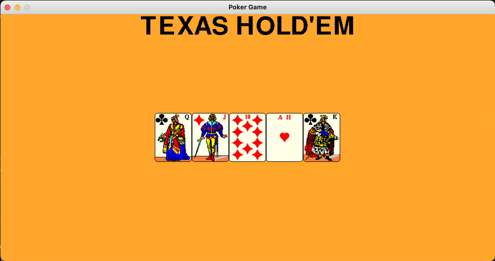

<!--Name Of Class -->

# HandScorer

<!-- Description -->

>A HandScorer scores a CardHand object.

<!-- Screenshots -->
<!-- ###### Screenshots
<!--  -->
<!-- 
  -->


<!-- Imports -->
<!-- ###### Imports
```python
import pygame
``` -->

<!-- Usage -->

###### Usage

```python
# Construct a CardHandSprite object
exHand = CardHandSprite()

# Add cards that match the scoring cases for testing
exHand.addCard(Card('King','Clubs'))
exHand.addCard(Card('Queen','Clubs'))
exHand.addCard(Card('Ace','Clubs'))
exHand.addCard(Card('Jack','Clubs'))
exHand.addCard(Card('Ten','Clubs'))

# Construct a HandScorer object
exhandScore = HandScorer()

# Prints the score of the hand and board given (Testing Purposes)
print(exhandScore._checkHand(board,hand))
```

<!-- Instance Variables -->
###### Instance Variables
| Name      | Data Type | Description           |
| --------- | --------- | --------------------- |
| `_score` | int       | the score of the hand |


###### Methods

<ul>

<!-- (Add Member Functions Here) -->
<!-- [`nameOfFunction(parameters)`](functions/nameOfFunction.md) -->
<!-- Make sure to create a .md file in the functions folder for EVERY function added -->

[`getScore(self,board,hand)`](methods/getScore.md)

[`resetScore(self)`](methods/resetScore.md)

[`_checkHand(self,board,hand)`](methods/_checkHand.md)

[`_checkCardMatches(self,allCards,numMatches)`](methods/_checkCardMatches.md)

[`_pair(self,allCards)`](methods/_pair.md)

[`_twoPair(self,allCards)`](methods/_twoPair.md)

[`_threeOfAKind(self,allCards)`](methods/_threeOfAKind.md)

[`_straight(self,allCards)`](methods/_straight.md)

[`_fourOfAKind(self,allCards)`](methods/_fourOfAKind.md)

[`_flush(self,allCards)`](methods/_flush.md)

[`_fullHouse(self,allCards)`](methods/_fullHouse.md)

[`_straightFlush(self,allCards)`](methods/_straightFlush.md)

[`_royalFlush(self,allCards)`](methods/_royalFlush.md)

[`highCard(self,board,hand)`](methods/highCard.md)

</ul>

---

<!-- Back to README.md -->
[back](../../../README.md)