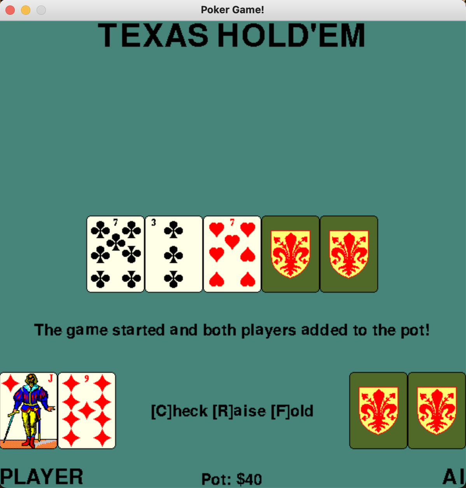

<!--Name Of Class -->

# PokerGameBase

<!-- Description -->

>A PokerGameBase object is in charge of creating the pokerGame and its functionality.

<!-- Screenshots -->
###### Screenshots
<!--  -->

 


<!-- Imports -->
###### Imports
```python
import pygame
from pygame.locals import *
from CardSprite import CardSprite
from DeckSprite import DeckSprite
from CardHandSprite import CardHandSprite
from GameText import GameText
from Pot import Pot
from PokerGameBaseConstants import PokerGameBaseConstants
from HandScorer import HandScorer
```

<!-- Usage -->

###### Usage

```python
# Construct a PokerGameBase object
game = PokerGameBase()

# Runs the game.
game.run()
```

<!-- Instance Variables -->
###### Instance Variables
| Name               | Data Type      | Description                                                |
| ------------------ | -------------- | ---------------------------------------------------------- |
| `_width`           | int            | width of screen                                            |
| `_height`          | int            | height of screen                                           |
| `_raiseInput`      | string         |                                                            |
| `_screen`          | Surface        | the pygame display screen                                  |
| `_background`      | Surface        | the background of  the display screen                      |
| `_titleText`       | GameText       | 'Texas Hold'em'                                            |
| `_playerText`      | GameText       | 'PLAYER' below player hand                                 |
| `_aiText`          | GameText       | 'AI' below ai hand                                         |
| `_playOptionText`  | GameText       | '[C]heck [R]aise [F]old'                                   |
| `_pot`             | GameText       | 'Pot: $' on bottom center                                  |
| `_raiseInputText`  | GameText       | 'Enter Raise Amount: $'                                    |
| `_enterOptionText` | GameText       | 'Press Enter When Done'                                    |
| `_startText`       | GameText       | 'The game started and both players added to the pot!'      |
| `_checkText`       | GameText       | 'The player just checked and the AI did too!'              |
| `_raiseText`       | GameText       | 'The player just raised and the AI added the same amount!' |
| `_foldText`        | GameText       | 'GAME OVER! The player folded! [R]estart!'                 |
| `_winText`         | GameText       | 'The player won and took the pot! [R]estart!'              |
| `_lostText`        | GameText       | 'The player lost and the AI took the pot! [R]estart!'      |
| `_tieText`         | GameText       | 'The player and the AI tied and split the pot! [R]estart!' |
| `_check`           | bool           | checks if player checked                                   |
| `_raise`           | bool           | checks if player raised                                    |
| `_fold`            | bool           | checks if player folded                                    |
| `_playerWin`       | bool           | checks if player won                                       |
| `_tie`             | bool           | checks if there is a tie                                   |
| `_deck`            | DeckSprite     | the deck of cards that deals to the board, player, and ai  |
| `_board`           | CardHandSprite | the board of cards                                         |
| `_boardScore`      | HandScorer     | the score of the board                                     |
| `_player`          | CardHandSprite | the player's hand of cards                                 |
| `_playerScore`     | HandScorer     | the player's hand score                                    |
| `_ai`              | CardHandSprite | the ai's hand of cards                                     |
| `_aiScore`         | HandScorer     | the ai's hand score                                        |


###### Methods

<ul>

<!-- (Add Member Functions Here) -->
<!-- [`nameOfFunction(parameters)`](functions/nameOfFunction.md) -->
<!-- Make sure to create a .md file in the functions folder for EVERY function added -->

[`positionGameText(self)`](methods/positionGameText.md)

[`dealCards(self,numCards,hand)`](methods/dealCards.md)

[`dealAllHands(self)`](methods/deallAllHands.md)

[`flipCardsInHand(self,hand)`](methods/flipCardsInHand.md)

[`initGame(self)`](methods/initGame.md)

[`theFlop(self)`](methods/theFlop.md)

[`theTurn(self)`](methods/theTurn.md)

[`theRiver(self)`](methods/theRiver.md)

[`nextTurn(self)`](methods/nextTurn.md)

[`check(self)`](methods/check.md)

[`fold(self)`](methods/fold.md)

[`raiseBet(self)`](methods/raiseBet.md)

[`draw(self)`](methods/draw.md)

[`run(self)`](methods/run.md)

</ul>

---

<!-- Back to README.md -->
[back](../../../README.md)