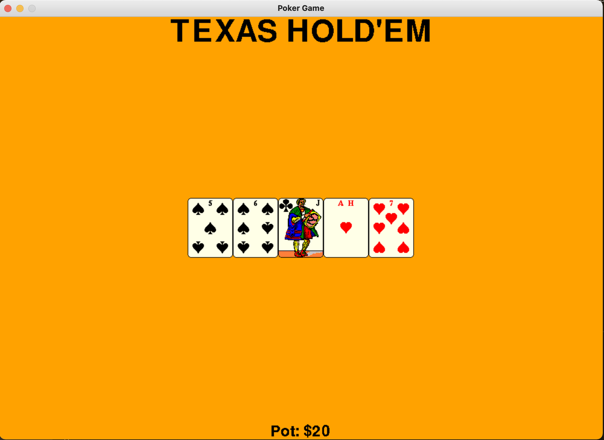

<!--Name Of Class -->

# Pot

<!-- Description -->

>A Pot is a GameText (a text with a message, font size, font color, and position) with a pot amount that can be set.

<!-- Screenshots -->
###### Screenshots
<!--  -->




<!-- Imports -->
###### Imports
```python
from GameText import GameText
from PokerGameBaseConstants import PokerGameBaseConstants
```

<!-- Usage -->

###### Usage

```python
# Constructs a Pot object with $20
pot = Pot(amount=PokerGameBaseConstants.MINIMUM_WAGE)

# Centers the pot text to the bottom center
pot.centerOnScreen(PokerGameBaseConstants.SCREEN_WIDTH,
                   PokerGameBaseConstants.SCREEN_HEIGHT, 'bottom_center')

# Draws the Pot object to the screen
pot.draw(screen)
```

<!-- Instance Variables -->
###### Instance Variables
| Name         | Data Type | Description                            |
| ------------ | --------- | -------------------------------------- |
| `_potAmount` | int       | the amount of money that is in the pot |


###### Methods

<ul>

<!-- (Add Member Functions Here) -->
<!-- [`nameOfFunction(parameters)`](functions/nameOfFunction.md) -->
<!-- Make sure to create a .md file in the functions folder for EVERY function added -->

[`getPotAmount(self)`](methods/getPotAmount.md)

[`setPotAmount(self,amount)`](methods/setPotAmount.md)

</ul>

---

<!-- Back to README.md -->
[back](../../../README.md)